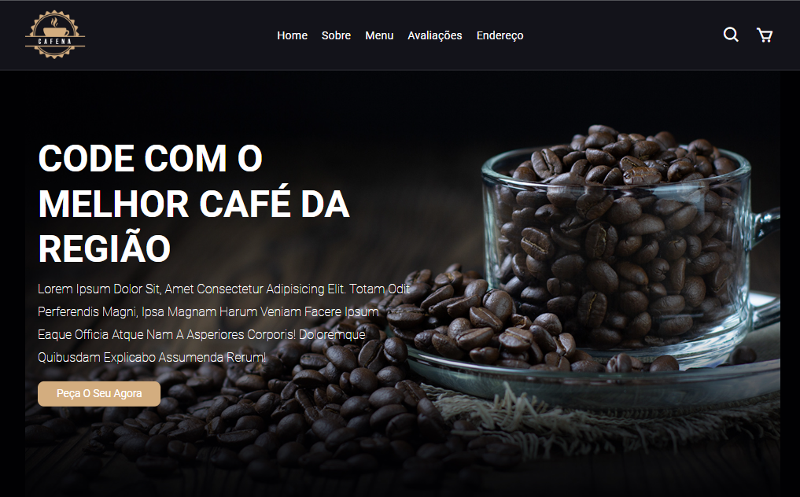
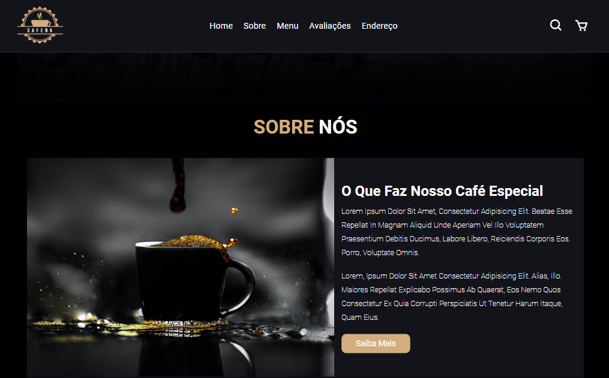
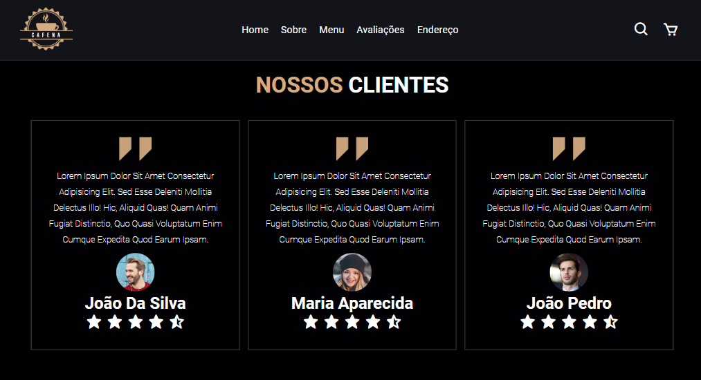
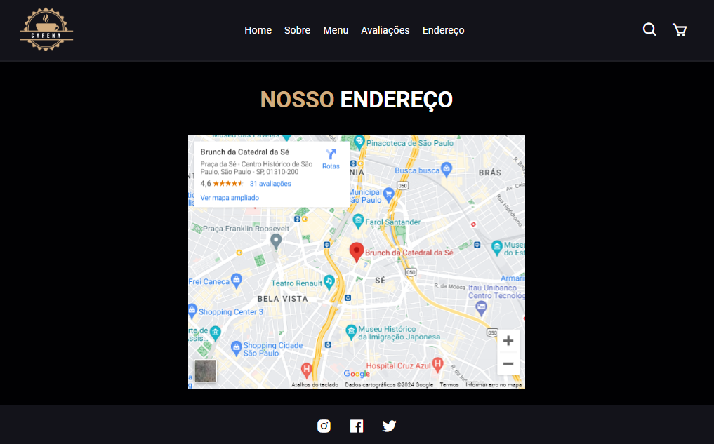

<h1 align="center">Projeto Cafeteria</h1>

<h2>Olá sejam bem-vindo</h2>

Compartilhando meu projeto de cafeteria em HTML e CSS!

Este projeto foi desenvolvido utilizando HTML e CSS, com foco em:

Conteúdo atraente: 

O site apresenta imagens de alta qualidade, textos informativos e uma paleta de cores aconchegante.
Alguns destaques do projeto:

Home: Uma imagem de fundo convidativa, um breve resumo da cafeteria e links para as principais seções do site.
Menu: Uma lista completa dos produtos da cafeteria, com fotos, descrições e preços.
Promoções: Uma seção dedicada às ofertas especiais da cafeteria, para atrair novos clientes.

Agradeço a todos que me acompanharam neste projeto e espero que ele inspire outros desenvolvedores a criarem sites incríveis!

<h4>Link:</h4>

>Deploy: https://daliosy.github.io/cafeteria

>Repoditório: https://github.com/DalioSY/cafeteria

>Linkedin: https://www.linkedin.com/in/dalio-s-yamada/

#html #css #webdevelopment #portfolio #designresponsivo #ux #ui #cafe
 
 

  <ul align="center">
    <h2 style="display: inline-block">Imagens:</h2>
  </ul>

 
  
  
  
  
  

