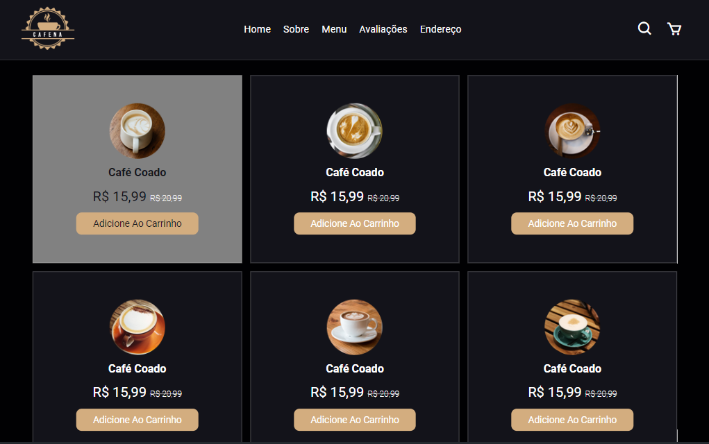

☕ Site de Cafeteria - Projeto Front-End
Conteúdo Atraente
Este projeto apresenta um site de cafeteria com imagens de alta qualidade, textos informativos e uma paleta de cores aconchegante, pensado para oferecer uma experiência acolhedora ao usuário.

🏡 Algumas seções em destaque:
Home:
Uma imagem de fundo convidativa, um breve resumo da cafeteria e links para as principais seções do site.

Menu:
Uma lista completa dos produtos da cafeteria, com fotos, descrições e preços.

Promoções:
Uma seção dedicada às ofertas especiais da cafeteria, para atrair novos clientes.

🚀 Links do Projeto:

<h4>Link:</h4>

>Deploy: https://site-cafeteria-js.vercel.app/

>Repoditório: https://github.com/joaocastelo1/site-cafeteria-js

>Linkedin: https://www.linkedin.com/in/joao-castelo-ferreira/

🛠️ Tecnologias utilizadas

HTML5

CSS3

Responsividade para diversos dispositivos

✨ Agradecimentos
Agradeço a todos que me acompanharam neste projeto. Espero que ele inspire outros desenvolvedores a criarem sites incríveis e a continuarem evoluindo na área de desenvolvimento web!

📢 Hashtags
#html #css #webdevelopment #portfolio #designresponsivo #ux #ui #cafeteria #frontend

 
 

  <ul align="center">
    <h2 style="display: inline-block">Imagens:</h2>
  </ul>

 
  
  
  
  
  

